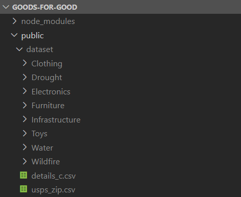

# goods-for-good

Download kafka (https://kafka.apache.org/downloads)
Navigate to the kafka folder
Start All Mongo Docker Containers
Start Zookeeper in the first terminal with the command - 
.\bin\windows\zookeeper-server-start.bat .\config\zookeeper.properties
Start Broker in the second terminal using the command -
.\bin\windows\kafka-server-start.bat .\config\server.properties
Open the project in VS Code
Download the Dataset - https://drive.google.com/drive/folders/1jxRhq7F2NNqh2W3sLbr22ZwpGLqBCdCD?usp=sharing 
Move the folder to the /public
The folder structure should look like: 
